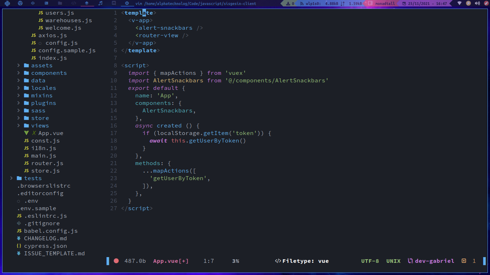
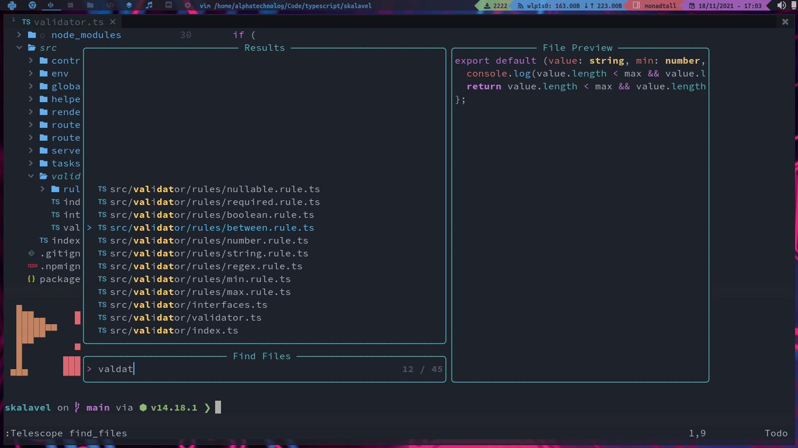

# Onedarker

Onedarker is a beautiful custom theme based on
the awesome onedark colors.

> This colorscheme is extracted from the lunarvim project

> This is my custom build for the onedarker colorscheme



## External plugins support

This colorscheme has support for this plugins:

- Treesitter
- diff
- Git
- highlights
- LSP
- markdown
- Notify
- palette
- Whichkey

## Getting started

To use this you can use `vim-plug`, `packer`, etc.

### With Packer

Put this on your packer config:

```lua
use {"AlphaTechnolog/onedarker.nvim"}
```

### With Vim Plug

With `vim-plug` you can use this:

```vim
Plug 'AlphaTechnolog/onedarker.nvim'
```

## Activing the colorscheme

You can use the `colorscheme` sentence:

```vim
colorscheme onedarker
```

Or with lua

```lua
require('onedarker')
```

## Some configuration variables

You can customize the onedarker look with this variables:

**NOTE**: The next example contains the default values of
these variables

### With lua

```lua
vim.g.onedarker_transparent_background = true
vim.g.onedarker_italic_comments = true
vim.g.onedarker_italic_keywords = true
vim.g.onedarker_italic_function = true
vim.g.onedarker_italic_variables = true
```

### With vim script

```vim
let g:onedarker_transparent_background = true
let g:onedarker_italic_comments = true
let g:onedarker_italic_keywords = true
let g:onedarker_italic_function = true
let g:onedarker_italic_variables = true
```

## Evil Lualine

I have a preincorpored lualine config for make more beautiful (my own style for lualine).
You can active it with lua like this:

```lua
require'onedarker.evil_lualine'
```

## Screenshots



